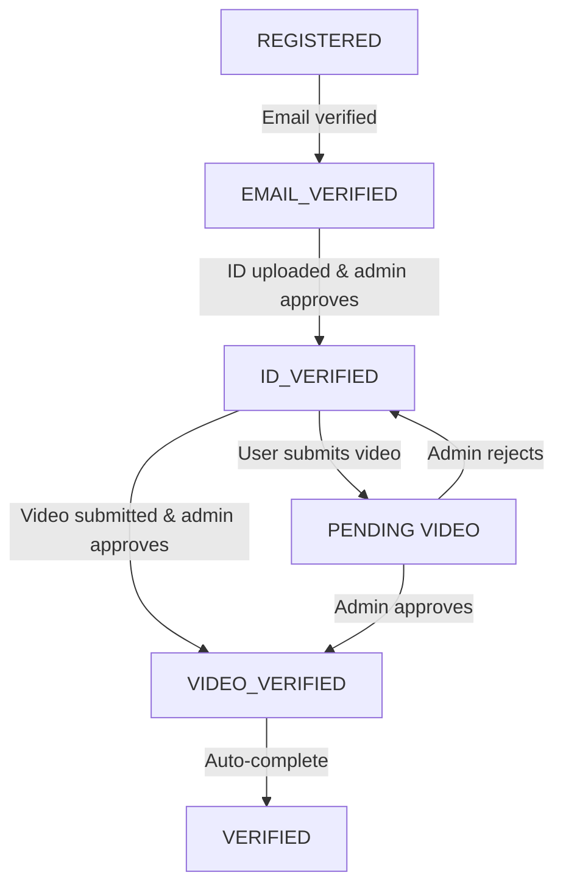

# Complete User Verification Flow

**Purpose:** End-to-end guide for identity verification journey  
**Audience:** Developers, QA, product managers  
**Last Updated:** November 13, 2025

---

## Table of Contents

1. [High-Level Flow](#high-level-flow)
2. [User Journey (Timeline)](#user-journey-timeline)
3. [Step-by-Step Implementation](#step-by-step-implementation)
4. [Status Tracking](#status-tracking)
5. [Admin Review Process](#admin-review-process)
6. [Error Recovery](#error-recovery)
7. [Database State Changes](#database-state-changes)

---

## High-Level Flow

```
Registration
    ↓
Email Verification
    ↓
ID Verification (DigiLocker)
    ↓
Video Verification
    ↓
Admin Review
    ↓
✓ Complete Onboarding
```

### Quick Timeline

| Step | Service | Status | Duration | Role |
|------|---------|--------|----------|------|
| 1 | Registration | REGISTERED | 5 min | User |
| 2 | Email Verification | EMAIL_VERIFIED | 5 min | User + Auto |
| 3 | ID Verification | ID_VERIFIED | 2-5 min | User + Admin |
| 4 | Video Verification | VIDEO_VERIFIED | 2-5 min | User + Admin |
| 5 | Onboarding Complete | VERIFIED | 1 min | System |

---

## User Journey (Timeline)

### Day 1: Registration & Email

```
10:00 AM
User registers with email and password
→ User.status = REGISTERED

10:01 AM
Verification email sent to user
User clicks email link
→ User.status = EMAIL_VERIFIED
→ Can now proceed to ID verification
```

### Day 1-2: ID Verification (DigiLocker)

```
10:05 AM
User initiates DigiLocker flow
→ DigiLockerSession created with status INITIATED

10:07 AM
User completes document upload
→ Cashfree sends RSA-signed response
→ Country validation passed ✓
→ DigiLockerSession.status = COMPLETED

10:08 AM
User data extracted:
  - Name, DOB, Address, ID number
  - Photo extracted from document

10:09 AM
Admin reviews DigiLocker data
→ DigiLockerSession.verified = true
→ User.status = ID_VERIFIED
→ User can now proceed to video verification
```

### Day 2-3: Video Verification

```
2:00 PM (next day)
User initiates video verification
→ VideoVerificationSession created
→ sessionId generated
→ 30-minute recording window starts
→ User.status still ID_VERIFIED

2:05 PM
User records video
- Face clearly visible
- Good lighting
- No glasses
- 15-30 seconds
→ Video uploaded to cloud storage

2:10 PM
User submits video
→ VideoVerificationSession.status = SUBMITTED
→ UserVideoVerification.status = PENDING
→ Admin notified of new submission

2:15 PM - Admin Reviews (may take up to 24 hours)
Admin watches video
→ Confirms face match with DigiLocker photo
→ Confirms liveness (real person, not photo)
→ Approves video
→ User.status = VIDEO_VERIFIED
→ UserVideoVerification.status = VERIFIED

2:16 PM
User receives notification
→ Verification complete
→ Can complete final onboarding
```

---

## Step-by-Step Implementation

### Phase 1: Registration (OTP-based)

**Frontend:**
```typescript
// Signup form submission - initiate OTP flow
const signup = async (email: string, username: string) => {
  const response = await fetch('/api/auth/send-otp', {
    method: 'POST',
    body: JSON.stringify({ email, username })
  });
  return response.json();
};
```

**Backend - AUTH Module:**
```typescript
// POST /api/auth/send-otp
async sendOtp(sendOtpDto: SendOtpDto) {
  // 1. Validate email doesn't already exist (verified)
  const existing = await prisma.user.findUnique({ where: { email } });
  if (existing && existing.emailVerified) {
    throw new BadRequestException('Email already registered');
  }
  
  // 2. Create or update user with status REGISTERED
  const user = await prisma.user.upsert({
    where: { email },
    create: {
      email,
      username,
      status: 'REGISTERED'
    },
    update: {
      status: 'REGISTERED'
    }
  });
  
  // 3. Generate and send OTP via email
  const otp = generateOtp(); // 6-digit OTP
  this.otpService.storeOtp(email, otp, 'signup'); // 10 min expiry
  await this.mailerService.sendOtpEmail(email, otp);
  
  return { 
    message: 'OTP sent to your email',
    status: 200
  };
}
```

**Database State After OTP Sent:**
```javascript
User {
  id: 'user_123',
  email: 'user@example.com',
  username: 'johndoe',
  status: 'REGISTERED',
  emailVerified: false,
  createdAt: 2025-11-13T10:00:00Z
}

OTP (in-memory) {
  email: 'user@example.com',
  code: '123456',
  expiresAt: 2025-11-13T10:10:00Z,
  purpose: 'signup',
  attempts: 0
}
```

---

### Phase 2: Email Verification (OTP Verification)

**Frontend:**
```typescript
// User receives OTP in email and enters it
const verifyEmail = async (email: string, otp: string) => {
  const response = await fetch('/api/auth/verify-otp', {
    method: 'POST',
    body: JSON.stringify({ email, otp })
  });
  return response.json();
};
```

**Backend - AUTH Module:**
```typescript
// POST /api/auth/verify-otp
async verifyOtp(email: string, otp: string) {
  // 1. Validate OTP exists and is not expired
  const storedOtp = this.otpService.getOtp(email);
  if (!storedOtp || storedOtp.expiresAt < Date.now()) {
    throw new BadRequestException('OTP expired or not found');
  }
  
  // 2. Validate OTP code
  if (storedOtp.code !== otp) {
    storedOtp.attempts++;
    if (storedOtp.attempts >= 3) {
      this.otpService.deleteOtp(email);
      throw new BadRequestException('OTP failed 3 times, request new OTP');
    }
    throw new BadRequestException('Invalid OTP');
  }
  
  // 3. Find user
  const user = await prisma.user.findUnique({ where: { email } });
  if (!user) {
    throw new NotFoundException('User not found');
  }
  
  // 4. Mark email as verified, update status
  const updated = await prisma.user.update({
    where: { id: user.id },
    data: {
      status: 'EMAIL_VERIFIED',
      emailVerified: true
    }
  });
  
  // 5. Clear OTP
  this.otpService.deleteOtp(email);
  
  // 6. Generate JWT tokens
  const accessToken = this.jwtService.sign({ 
    sub: user.id, 
    email: user.email 
  }); // 7-day expiry
  
  const refreshToken = this.jwtService.sign(
    { sub: user.id, type: 'refresh' },
    { expiresIn: '30d' }
  );
  
  return {
    userId: user.id,
    accessToken,
    refreshToken,
    message: 'Email verified successfully'
  };
}
```

**Database State After Email Verification:**
```javascript
User {
  id: 'user_123',
  email: 'user@example.com',
  username: 'johndoe',
  status: 'EMAIL_VERIFIED',  // ← Updated
  emailVerified: true,        // ← Updated
  createdAt: 2025-11-13T10:00:00Z
}

JWT Tokens {
  accessToken: 'eyJhbGciOiJIUzI1NiIsInR5cCI6IkpXVCJ9...',
  refreshToken: 'eyJhbGciOiJIUzI1NiIsInR5cCI6IkpXVCJ9...',
  accessTokenExpires: 7 days,
  refreshTokenExpires: 30 days
}
```

---

### Phase 3: ID Verification (DigiLocker)

**Frontend:**
```typescript
const token = accessToken; // From email verification

// 1. Select country (required before DigiLocker)
const countryRes = await fetch('/api/auth/select-country', {
  method: 'POST',
  headers: { Authorization: `Bearer ${token}` },
  body: JSON.stringify({ country: 'India' })
});

// 2. Authorize DigiLocker flow
const authorizeRes = await fetch('/api/auth/digilocker/authorize', {
  method: 'POST',
  headers: { Authorization: `Bearer ${token}` }
});

const { redirectUrl } = await authorizeRes.json();

// 3. Redirect user to Cashfree (handles document upload)
window.location.href = redirectUrl;

// 4. After Cashfree redirects back with response
const verifyRes = await fetch('/api/auth/digilocker/verify', {
  method: 'POST',
  headers: { Authorization: `Bearer ${token}` },
  body: JSON.stringify({ 
    encryptedResponse: cashfreeResponse // From Cashfree redirect
  })
});
```

**Backend - AUTH Module (DigiLocker endpoints):**
```typescript
// Phase 3a: POST /api/auth/select-country
async selectCountry(userId: string, selectCountryDto: SelectCountryDto) {
  // 1. Validate user is EMAIL_VERIFIED
  const user = await prisma.user.findUnique({ where: { id: userId } });
  if (user.status !== 'EMAIL_VERIFIED') {
    throw new BadRequestException('Email not verified yet');
  }
  
  // 2. Store country selection
  const updated = await prisma.user.update({
    where: { id: userId },
    data: { country: selectCountryDto.country }
  });
  
  return { success: true, country: updated.country };
}

// Phase 3b: POST /api/auth/digilocker/authorize
async authorizeDigiLocker(userId: string) {
  const user = await prisma.user.findUnique({ where: { id: userId } });
  
  // Check country restrictions
  if (!isCountrySupported(user.country)) {
    throw new BadRequestException(
      `DigiLocker not available in ${user.country}`
    );
  }
  
  // Generate Cashfree redirect URL
  const redirectUrl = this.cashfreeService.generateAuthUrl(userId);
  
  return { redirectUrl };
}

// Phase 3c: POST /api/auth/digilocker/verify
async verifyDigiLocker(userId: string, encryptedResponse: string) {
  // 1. Decrypt Cashfree response (RSA)
  const decrypted = this.cryptoService.decryptCashfreeResponse(encryptedResponse);
  
  // 2. Extract user data from DigiLocker
  const userData = {
    fullName: decrypted.name,
    dateOfBirth: decrypted.dob,
    address: decrypted.address,
    idNumber: decrypted.id,
    photoUrl: decrypted.photo_url
  };
  
  // 3. Store DigiLocker data
  const verification = await prisma.userVerification.create({
    data: {
      userId,
      digiLockerData: userData,
      verificationSource: 'DIGILOCKER'
    }
  });
  
  // 4. Update user status (marked for admin review)
  await prisma.user.update({
    where: { id: userId },
    data: { status: 'ID_VERIFICATION_PENDING' }
  });
  
  return { 
    success: true,
    message: 'DigiLocker data submitted. Awaiting admin approval.'
  };
}

// Phase 3d: Admin approval (separate admin endpoint)
// Admin reviews the DigiLocker data and approves
async adminApproveDigiLocker(userId: string, adminId: string) {
  // Update verification status
  await prisma.userVerification.update({
    where: { userId },
    data: {
      verified: true,
      verifiedBy: adminId,
      verifiedAt: new Date()
    }
  });
  
  // Update user status
  const updated = await prisma.user.update({
    where: { id: userId },
    data: { status: 'ID_VERIFIED' }
  });
  
  return { success: true, userStatus: 'ID_VERIFIED' };
}
```

**Database State After DigiLocker Submission:**
```javascript
User {
  id: 'user_123',
  email: 'user@example.com',
  username: 'johndoe',
  status: 'ID_VERIFICATION_PENDING',  // ← Submitted, awaiting admin
  country: 'India',
  createdAt: 2025-11-13T10:00:00Z
}

UserVerification {
  userId: 'user_123',
  digiLockerData: {
    fullName: 'John Doe',
    dateOfBirth: '1990-01-01',
    address: '123 Main St, City',
    idNumber: 'ABC123XYZ',
    photoUrl: 's3://bucket/photo.jpg'
  },
  verificationSource: 'DIGILOCKER',
  verified: false,
  createdAt: 2025-11-13T10:05:00Z
}
```

**Database State After Admin Approval:**
```javascript
User {
  id: 'user_123',
  status: 'ID_VERIFIED',  // ← Updated after admin approval
  ...
}

UserVerification {
  ...
  verified: true,
  verifiedBy: 'admin_456',
  verifiedAt: 2025-11-13T10:20:00Z
}
```
  };
}

// Phase 3b: POST /api/digilocker/complete
async completeDigi(userId: string, encryptedResponse: string) {
  // 1. Decrypt Cashfree response (RSA)
  const decrypted = decryptCashfreeResponse(encryptedResponse);
  
  // 2. Extract data: name, DOB, address, ID photo
  const userData = {
    fullName: decrypted.name,
    dateOfBirth: decrypted.dob,
    address: decrypted.address,
    idNumber: decrypted.id,
    photoUrl: decrypted.photo_url,
    country: decrypted.country
  };
  
  // 3. Validate country (if restricted)
  if (!isCountryAllowed(userData.country)) {
    throw new BadRequestException(
      `Services not available in ${userData.country}`
    );
  }
  
  // 4. Store DigiLocker data
  const verification = await prisma.userVerification.create({
    data: {
      userId,
      digiLockerData: userData,
      verificationSource: 'DIGILOCKER',
      externalId: decrypted.id
    }
  });
  
  // 5. Update session status
  await prisma.digiLockerSession.update({
    where: { id: session.id },
    data: {
      status: 'COMPLETED',
      verified: true
    }
  });
  
  return { success: true, message: 'DigiLocker data saved' };
}

// Phase 3c: Admin reviews (separate admin panel)
// Admin approves in admin panel
// → Admin calls /api/admin/digilocker/{userId}/approve
async adminApproveDigi(userId: string, adminId: string) {
  // Update user status to ID_VERIFIED
  const updated = await prisma.user.update({
    where: { id: userId },
    data: {
      status: 'ID_VERIFIED'  // ← Can now do video verification
    }
  });
  
  // Update verification record
  await prisma.userVerification.update({
    where: { userId },
    data: {
      verified: true,
      verifiedBy: adminId
    }
  });
  
  // Notify user
  await this.notificationService.sendEmail(user.email, 
    'Your ID verification passed!');
  
  return { success: true };
}
```

**Database State After ID Verification:**
```javascript
User {
  id: 'user_123',
  status: 'ID_VERIFIED',  // ← Updated after admin approval
  createdAt: 2025-11-13T10:00:00Z
}

UserVerification {
  userId: 'user_123',
  digiLockerData: { name, dob, address, idNumber, photo },
  verified: true,
  verifiedBy: 'admin_456',
  verificationSource: 'DIGILOCKER'
}

DigiLockerSession {
  userId: 'user_123',
  status: 'COMPLETED',
  verified: true
}
```

---

### Phase 4: Video Verification Upload

**Frontend:**
```typescript
const token = accessToken; // From email verification, user must be ID_VERIFIED

// 1. User records video (MediaRecorder API)
const recordVideo = async () => {
  const stream = await navigator.mediaDevices.getUserMedia({ video: true });
  const recorder = new MediaRecorder(stream);
  recorder.start();
  // ... user records for 15-30 seconds ...
  recorder.stop();
  return blob; // Returns Blob
};

// 2. Upload video to storage (S3, etc)
const uploadVideo = async (blob: Blob, userId: string) => {
  // Use your storage service (S3, GCS, etc)
  return await storageService.upload(blob, `videos/${userId}_${Date.now()}.mp4`);
};

// 3. Submit video for verification
const submitVideo = async (token: string, videoBlob: Blob) => {
  const formData = new FormData();
  formData.append('video', videoBlob);
  
  const response = await fetch('/api/auth/upload-video', {
    method: 'POST',
    headers: { Authorization: `Bearer ${token}` },
    body: formData
  });
  return response.json();
};

// 4. Check verification status
const checkVerificationStatus = async (token: string) => {
  const response = await fetch('/api/auth/verification/status', {
    headers: { Authorization: `Bearer ${token}` }
  });
  return response.json();
};
```

**Backend - AUTH Module (Video Upload endpoint):**
```typescript
// Phase 4a: POST /api/auth/upload-video
// Uses FileInterceptor to handle multipart file upload
async uploadVideo(userId: string, uploadedFile: Express.Multer.File) {
  // 1. Validate user is ID_VERIFIED
  const user = await prisma.user.findUnique({ where: { id: userId } });
  if (user.status !== 'ID_VERIFIED') {
    throw new BadRequestException(
      'User must complete ID verification (DigiLocker) first'
    );
  }
  
  // 2. Validate file
  if (!uploadedFile) {
    throw new BadRequestException('No video file provided');
  }
  
  const maxFileSize = 100 * 1024 * 1024; // 100MB
  if (uploadedFile.size > maxFileSize) {
    throw new BadRequestException('File exceeds maximum size (100MB)');
  }
  
  // 3. Upload to S3 or storage service
  const videoUrl = await this.storageService.upload(
    uploadedFile,
    `videos/${userId}_${Date.now()}_${uploadedFile.originalname}`
  );
  
  // 4. Create or update video verification record
  const videoVerification = await prisma.userVideoVerification.upsert({
    where: { userId },
    create: {
      userId,
      videoUrl,
      videoDuration: 0, // Could be extracted from video metadata
      videoFormat: uploadedFile.mimetype,
      videoSize: uploadedFile.size,
      status: 'PENDING'
    },
    update: {
      videoUrl,
      videoDuration: 0,
      videoSize: uploadedFile.size,
      status: 'PENDING'
    }
  });
  
  // 5. Notify admin of new submission
  await this.notificationService.notifyAdmins({
    type: 'VIDEO_SUBMITTED',
    userId,
    userName: user.username,
    videoUrl
  });
  
  return {
    success: true,
    message: 'Video submitted successfully. Admin will review within 24 hours.',
    status: 'PENDING'
  };
}
```

**Database State After Video Upload:**
```javascript
User {
  id: 'user_123',
  email: 'user@example.com',
  username: 'johndoe',
  status: 'ID_VERIFIED',  // Still ID_VERIFIED, waiting for video approval
  createdAt: 2025-11-13T10:00:00Z
}

UserVideoVerification {
  userId: 'user_123',
  videoUrl: 's3://bucket/videos/user_123_timestamp_video.mp4',
  videoDuration: 28,
  videoFormat: 'video/mp4',
  videoSize: 5242880,
  status: 'PENDING',  // ← Awaiting admin review
  verified: false,
  createdAt: 2025-11-13T14:05:00Z
}
```

**Admin Review & Approval:**
```typescript
// Admin reviews video and approves
async adminApproveVideo(userId: string, adminId: string, faceMatchScore: number) {
  // 1. Update video verification
  const updated = await prisma.userVideoVerification.update({
    where: { userId },
    data: {
      verified: true,
      status: 'VERIFIED',
      verifiedBy: adminId,
      verifiedAt: new Date(),
      faceMatchScore
    }
  });
  
  // 2. Update user status to VIDEO_VERIFIED
  const user = await prisma.user.update({
    where: { id: userId },
    data: { status: 'VIDEO_VERIFIED' }
  });
  
  // 3. Notify user
  await this.notificationService.sendEmail(
    user.email,
    'Video verification approved! Your account is now fully verified.'
  );
  
  return { success: true, userStatus: 'VIDEO_VERIFIED' };
}
```

**Database State After Admin Approval:**
```javascript
User {
  id: 'user_123',
  status: 'VIDEO_VERIFIED',  // ← Updated after admin approval
  createdAt: 2025-11-13T10:00:00Z
}

UserVideoVerification {
  userId: 'user_123',
  videoUrl: 's3://bucket/videos/user_123_timestamp_video.mp4',
  status: 'VERIFIED',  // ← Approved
  verified: true,
  verifiedBy: 'admin_456',
  faceMatchScore: 0.95,
  verifiedAt: 2025-11-13T14:20:00Z
}
```
  });
  
  return {
    sessionId,
    expiresAt: session.expiresAt,
    instructions: {
      maxDuration: 30,
      formats: ['mp4', 'webm', 'mov'],
      guidelines: ['Face visible', 'Good lighting', ...]
    }
  };
}
```

---

### Phase 5: Complete Onboarding

**Backend - AUTO (no user action):**
```typescript
// After VIDEO_VERIFIED, auto-complete onboarding
// Option 1: Scheduled job that checks for VIDEO_VERIFIED users
async completeOnboarding() {
  const readyUsers = await prisma.user.findMany({
    where: { status: 'VIDEO_VERIFIED' },
    include: { subscription: true }
  });
  
  for (const user of readyUsers) {
    // Check all requirements met
    const requirements = {
      emailVerified: !!user.emailVerified,
      idVerified: !!user.userVerification,
      videoVerified: !!user.videoVerification?.verified,
      termsAccepted: !!user.termsAcceptedAt
    };
    
    if (Object.values(requirements).every(v => v === true)) {
      // Complete onboarding
      const updated = await prisma.user.update({
        where: { id: user.id },
        data: {
          status: 'VERIFIED',
          completedAt: new Date()
        }
      });
      
      // Send welcome email
      await mailerService.sendWelcomeEmail(user.email);
    }
  }
}

// Option 2: Explicit endpoint (if user triggers)
// POST /api/auth/complete-onboarding
async completeOnboarding(userId: string) {
  const user = await prisma.user.findUnique({ 
    where: { id: userId },
    include: { 
      userVerification: true,
      videoVerification: true 
    }
  });
  
  // Validate all requirements
  if (user.status !== 'VIDEO_VERIFIED') {
    throw new BadRequestException('Verification not complete');
  }
  
  // Mark as VERIFIED
  return await prisma.user.update({
    where: { id: userId },
    data: { status: 'VERIFIED', completedAt: new Date() }
  });
}
```

**Final Database State:**
```javascript
User {
  id: 'user_123',
  email: 'user@example.com',
  name: 'John Doe',
  status: 'VERIFIED',  // ← Final status
  emailVerified: true,
  createdAt: 2025-11-13T10:00:00Z,
  completedAt: 2025-11-13T14:30:00Z  // ← Onboarding complete
}
```

---

## Status Tracking

### User Status Diagram



### Status Flow Table

| Status | Achieved By | Next Step | Time to Next |
|--------|------------|-----------|--------------|
| REGISTERED | Registration | Verify email | 5 min |
| EMAIL_VERIFIED | Email link | Complete DigiLocker | 2-5 min |
| ID_VERIFIED | Admin approval | Record video | Variable |
| VIDEO_VERIFIED | Admin approval | Auto-complete | 1 min |
| VERIFIED | System (auto) | Use account | Instant |

### Checking User Status (API)

```typescript
// Get current user status
async getUserStatus(userId: string) {
  const user = await prisma.user.findUnique({
    where: { id: userId },
    include: {
      userVerification: true,
      videoVerification: true,
      digiLockerSessions: true
    }
  });
  
  return {
    status: user.status,
    emailVerified: user.emailVerified,
    idVerification: {
      completed: !!user.userVerification?.verified,
      verifiedAt: user.userVerification?.verifiedAt
    },
    videoVerification: {
      completed: user.videoVerification?.verified,
      status: user.videoVerification?.status,
      rejectionReason: user.videoVerification?.rejectionReason
    },
    completedAt: user.completedAt
  };
}
```

---

## Admin Review Process

### Admin Dashboard Workflow

```
1. Login to admin panel
   ↓
2. View pending verifications
   - DigiLocker submissions (ID photos)
   - Video submissions (user videos)
   ↓
3. For each submission:
   - Review document/video quality
   - Check face match
   - Verify data accuracy
   - Approve ✓ or Reject ✗
   ↓
4. Approve
   - User notified
   - Status updated
   - Next step unlocked
   ↓
5. Reject
   - User notified with reason
   - Can re-submit
```

### Endpoints Admins Use

```bash
# Get pending DigiLocker reviews
GET /api/admin/digilocker/pending

# Review DigiLocker submission
GET /api/admin/digilocker/{userId}

# Approve DigiLocker
POST /api/admin/digilocker/{userId}/approve

# Reject DigiLocker
POST /api/admin/digilocker/{userId}/reject

# Get pending video reviews
GET /api/video-verification/admin/pending

# Watch video (returns video URL)
GET /api/admin/videos/{videoId}

# Approve video
POST /api/video-verification/admin/verify

# Reject video
POST /api/video-verification/admin/reject
```

### SLA (Service Level Agreement)

| Step | Target Time | Max Time |
|------|-----------|----------|
| Email verification | Auto | Instant |
| DigiLocker review | 2 hours | 24 hours |
| Video review | 2 hours | 24 hours |
| Account ready | 4 hours | 48 hours |

---

## Error Recovery

### Scenario 1: User Doesn't Verify Email

```
User registers but doesn't click email link
↓
After 7 days, send reminder email
↓
If still not clicked after 30 days, soft-delete account
```

**Implementation:**
```typescript
// Scheduled job: every day at 2 AM
async cleanupUnverifiedAccounts() {
  const unverifiedOlderThan7Days = await prisma.user.findMany({
    where: {
      status: 'REGISTERED',
      createdAt: { lt: new Date(Date.now() - 7 * 24 * 60 * 60000) }
    }
  });
  
  // Send reminder
  for (const user of unverifiedOlderThan7Days) {
    await mailerService.sendVerificationReminder(user.email);
  }
}
```

### Scenario 2: DigiLocker Session Expires

```
User initiates but doesn't complete in 30 min
↓
Session expires
↓
User tries to submit → Error: "Session expired"
↓
User clicks "Try Again" → New session created
```

**Implementation:**
```typescript
// In service
if (session.expiresAt < new Date()) {
  throw new BadRequestException(
    'Session expired. Please initiate again.'
  );
}
```

### Scenario 3: Video Rejected Multiple Times

```
User video rejected (e.g., "Face not visible")
↓
User re-submits new video
↓
Rejected again
↓
After 3 rejections, escalate to manual review or support
```

**Implementation:**
```typescript
async rejectVideo(userId: string, dto: AdminRejectVideoDto) {
  // Count rejections
  const rejectionCount = await prisma.userVideoVerification.count({
    where: {
      userId,
      status: 'REJECTED'
    }
  });
  
  if (rejectionCount >= 3) {
    // Escalate
    await notificationService.escalateToSupport(userId);
  }
}
```

---

## Database State Changes

### Complete State Transition

**T=0 (Registration)**
```javascript
User { id, email, status: 'REGISTERED', createdAt }
```

**T+5min (Email Verified)**
```javascript
User { ..., status: 'EMAIL_VERIFIED', emailVerified: true }
```

**T+10min (DigiLocker Initiated)**
```javascript
User { ..., status: 'EMAIL_VERIFIED' }
DigiLockerSession { 
  userId, 
  status: 'INITIATED', 
  expiresAt: +30min 
}
```

**T+12min (DigiLocker Complete)**
```javascript
DigiLockerSession { ..., status: 'COMPLETED' }
UserVerification { userId, digiLockerData, verified: false }
```

**T+2 hours (Admin Approves DigiLocker)**
```javascript
User { ..., status: 'ID_VERIFIED' }
UserVerification { ..., verified: true, verifiedBy, verifiedAt }
```

**T+2h5m (Video Session Initiated)**
```javascript
VideoVerificationSession { userId, status: 'INITIATED', expiresAt: +30min }
```

**T+2h10m (Video Submitted)**
```javascript
VideoVerificationSession { ..., status: 'SUBMITTED' }
UserVideoVerification { userId, videoUrl, status: 'PENDING', verified: false }
```

**T+2h20m (Admin Approves Video)**
```javascript
User { ..., status: 'VIDEO_VERIFIED' }
UserVideoVerification { ..., verified: true, status: 'VERIFIED', verifiedBy, verifiedAt }
```

**T+2h21m (Onboarding Auto-Complete)**
```javascript
User { ..., status: 'VERIFIED', completedAt }
```

---

## Related Documentation

- [DigiLocker Verification Details](../digilocker/README.md)
- [Video Verification Details](../video-verification/README.md)
- [API Documentation](../INDEX.md)

---

**Last Updated:** November 13, 2025  
**Maintained by:** Backend Team
